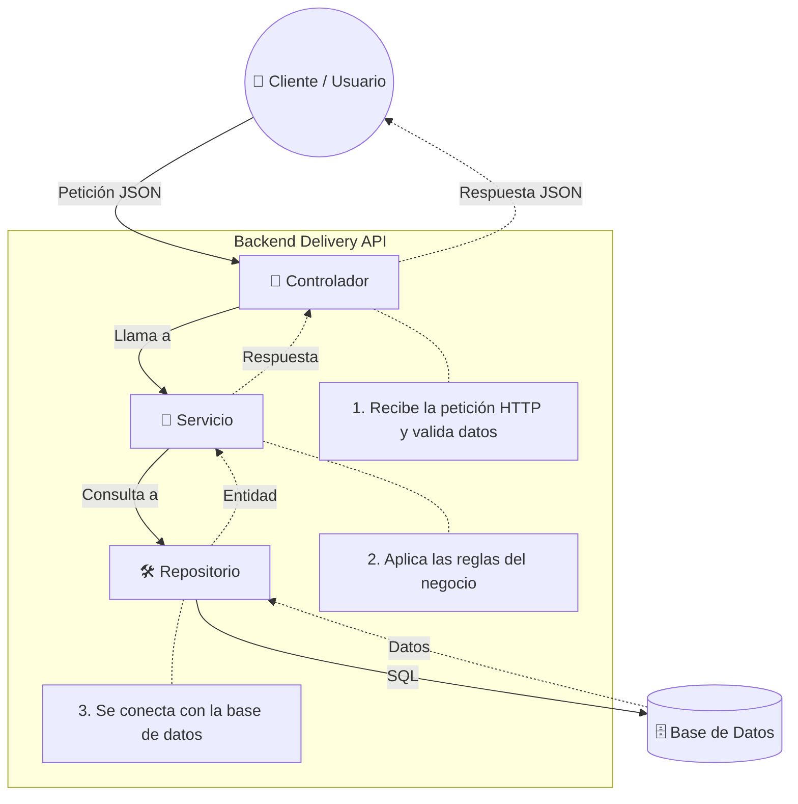

# Arquitectura del Proyecto Delivery API

Este proyecto sigue una **Arquitectura en Capas (Layered Architecture)** estricta, diseñada para separar la lógica de negocio de los detalles de infraestructura (Base de datos, Framework HTTP).

## 🏗 Diagrama de Flujo de Datos

El flujo de control siempre va desde el exterior hacia el interior, respetando la **Regla de Dependencia**:

