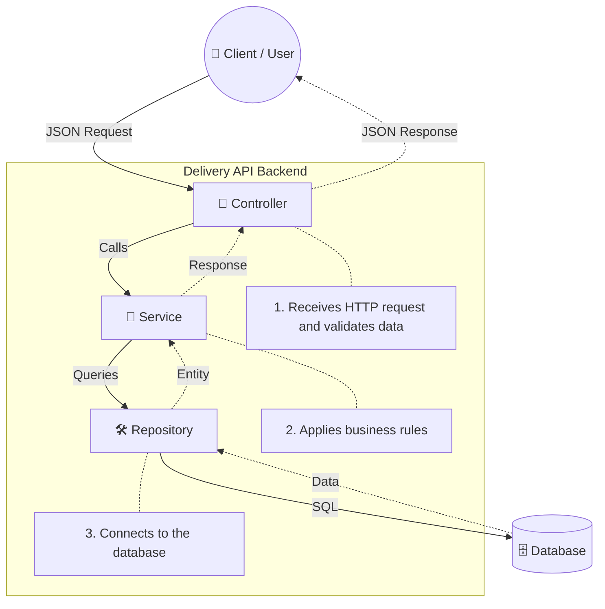
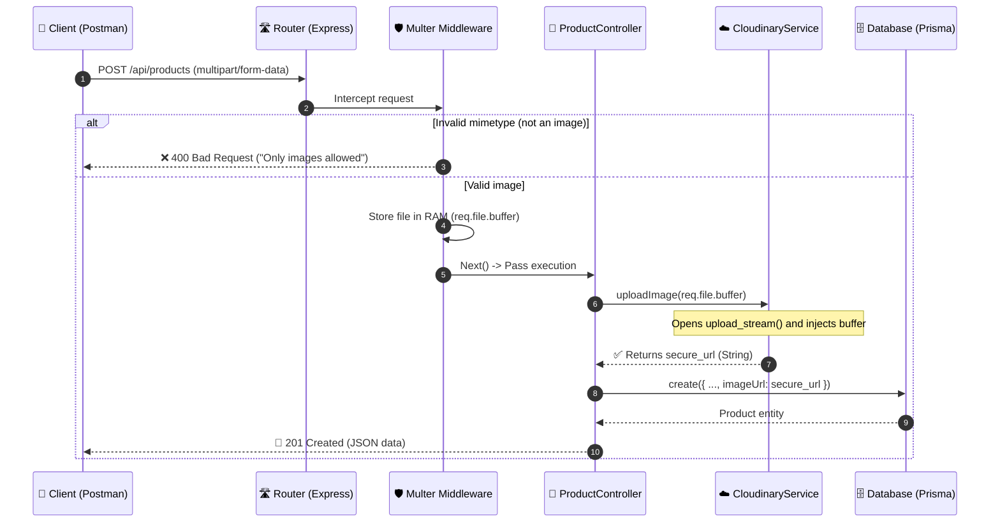

# Delivery API Project Architecture

This project follows a strict **Layered Architecture**, designed to separate business logic from infrastructure details (Database, HTTP Framework).

## 🏗 Data Flow Diagram

The control flow always goes from the outside in, respecting the **Dependency Rule**:

```mermaid
graph TD
    %% External Actors
    User((👤 Client / User))
    DB[(🗄️ Database)]

    %% Your System (Main Box)
    subgraph "Delivery API Backend"
        direction TB
        
        %% Main Components
        Controller[📡 Controller]
        Service[🧠 Service]
        Repo[🛠️ Repository]
        
        %% Simple explanatory notes
        note1[1. Receives HTTP request and validates data]
        note2[2. Applies business rules]
        note3[3. Connects to the database]

        %% Visual connections for notes (Dotted style)
        Controller -.- note1
        Service -.- note2
        Repo -.- note3
    end

    %% Information Flow (Arrows)
    User -->|JSON Request| Controller
    Controller -->|Calls| Service
    Service -->|Queries| Repo
    Repo -->|SQL| DB
    
    %% Return flow
    DB -.->|Data| Repo
    Repo -.->|Entity| Service
    Service -.->|Response| Controller
    Controller -.->|JSON Response| User
```
 

## 📁 Architecture Structure Overview

The project follows a strict Layered Architecture pattern to maintain modularity and separation of concerns. Below is the description of each layer and its responsibilities within the system:

### 1. CORE
**Responsibility:** Defines the fundamental business entities and the core features of our classes. This layer is entirely independent of external frameworks or databases.

* **`entities/`**: Defines the domain classes with the exact attributes required for our entities. 
  * *Example:* In `User.ts`, we define core features such as `name`, `email`, `role`, etc.
* **`interfaces/`**: Defines contracts containing function signatures (e.g., `findByEmail`, `saveUser`) required to access system features. 
  * *Example:* `IUserRepository` declares methods that dictate the rules for data access, acting as a strict contract for any external implementation.

### 2. INFRASTRUCTURE
**Responsibility:** Handles the outside world, including HTTP requests, API routing, and direct database communication.

* **`controllers/`**: Responsible for handling HTTP requests and responses from the frontend. They receive data, validate it, and request the Services to process the information (typically handling data through JSON).
* **`repositories/`**: Implements the functionalities defined in the `core/interfaces/` and communicates directly with the database. 
  * *Example:* `PrismaUserRepository` uses methods like `findByEmail` to access the database and retrieve the specific user.
* **`web/routes/`**: Acts as the API router and the Composition Root. This is where we group the endpoints of the API and perform Dependency Injection (connecting the repository, service, and controller).
* **`database/`**: Defines the global instance used to communicate with the database engine. 
  * *Example:* We instantiate `PrismaClient` here to translate our code into SQL sentences efficiently.

### 3. SERVICES
**Responsibility:** Contains the pure business logic for the system.
* **Use Cases:** Handles operations such as user registration, applying specific business rules, and performing security tasks like password encryption. It acts as the bridge between the external requests and the data layer.

### 4. SHARED / DTOs (Data Transfer Objects)
**Responsibility:** Manages data validation and structures shared across layers.
* **Validation:** We use tools like `Zod` to define objects with the exact characteristics and types we expect when receiving data from external sources, ensuring the system only processes valid information.

## ☁️ Image Upload Flow (Cloudinary & Multer)

Handling file uploads requires a specific flow to avoid overloading our server's storage and memory. We use **Multer** to intercept the `multipart/form-data` requests and store the image temporarily in a RAM `Buffer`. Then, **Cloudinary** processes this buffer via a continuous `Stream`.

```mermaid
sequenceDiagram
    autonumber
    participant Client as 👤 Client (Postman)
    participant Route as 🛣️ Router (Express)
    participant Multer as 🛡️ Multer Middleware
    participant Controller as 📡 ProductController
    participant Cloudinary as ☁️ CloudinaryService
    participant DB as 🗄️ Database (Prisma)

    Client->>Route: POST /api/products (multipart/form-data)
    Route->>Multer: Intercept request
    
    alt Invalid mimetype (not an image)
        Multer-->>Client: ❌ 400 Bad Request ("Only images allowed")
    else Valid image
        Multer->>Multer: Store file in RAM (req.file.buffer)
        Multer->>Controller: Next() -> Pass execution
        Controller->>Cloudinary: uploadImage(req.file.buffer)
        
        note over Cloudinary: Opens upload_stream() and injects buffer
        Cloudinary-->>Controller: ✅ Returns secure_url (String)
        
        Controller->>DB: create({ ..., imageUrl: secure_url })
        DB-->>Controller: Product entity
        Controller-->>Client: 🚀 201 Created (JSON data)
    end
```
